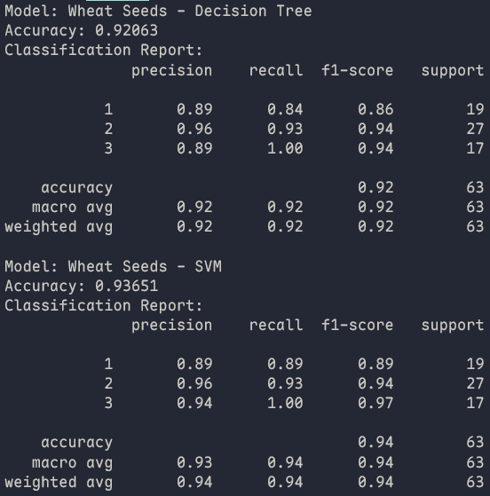
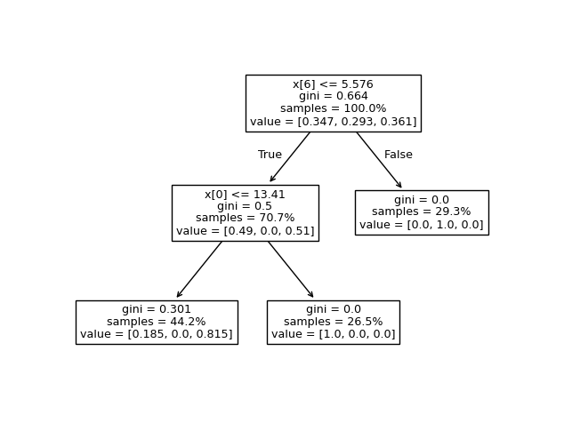
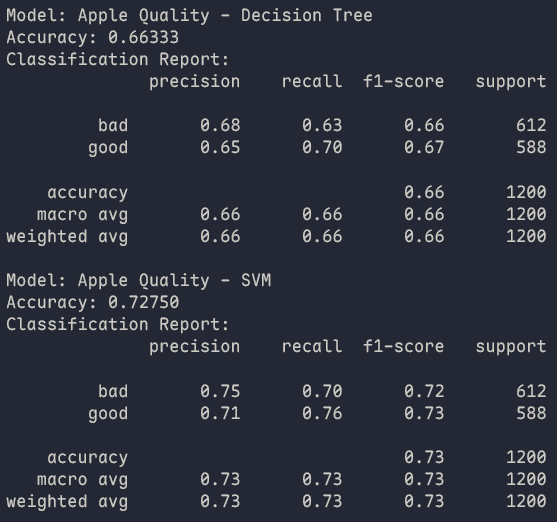
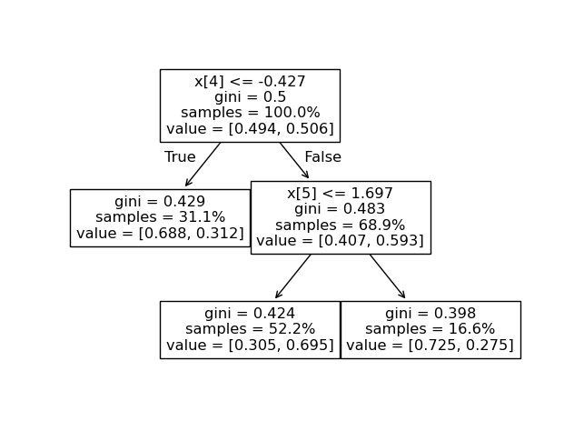
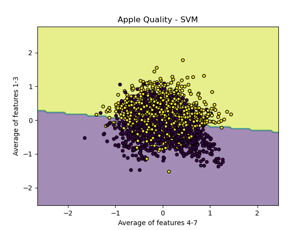

# Classification

## Authors

- Stefan Karczewski (s27459)
- Łukasz Ogorzałek (s27447)

## Running

Make sure you have uv and python, see "Environment Setup" in the main [README.md](../README.md) for more detailed instructions.

When inside the `4-classification` directory:

- Run classification: `uv run main.py`

## Example Usage

### Wheat Seeds Dataset

Dataset: https://machinelearningmastery.com/standard-machine-learning-datasets/

### Apple Quality Dataset

Dataset: https://www.kaggle.com/datasets/nelgiriyewithana/apple-quality

