# Neural Networks

## Authors

- Stefan Karczewski (s27459)
- Łukasz Ogorzałek (s27447)

## Running

Make sure you have uv and python, see "Environment Setup" in the main [README.md](../README.md) for more detailed instructions.

When inside the `5-neural-net` directory:

- Wheat seeds dataset: `uv run wheat_seeds.py`
- CIFAR10 dataset: `uv run cifar10.py`
- Fashion MNIST dataset: `uv run fashion.py`

## Example Usage

### Wheat Seeds Dataset

Dataset: https://machinelearningmastery.com/standard-machine-learning-datasets/

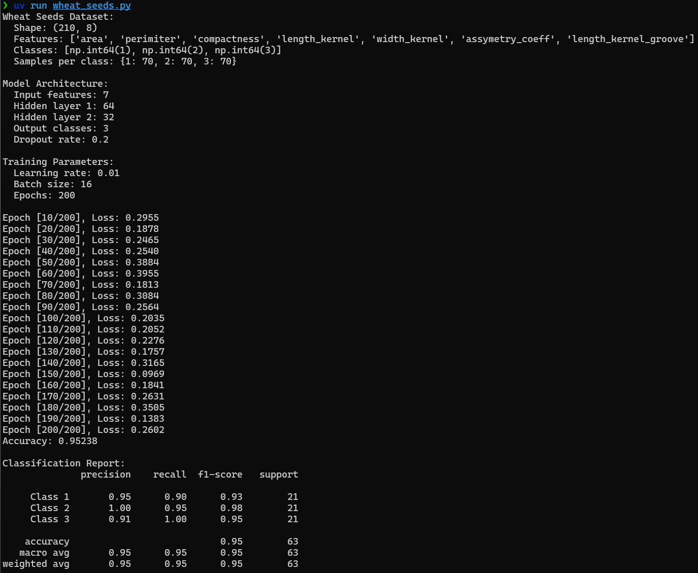
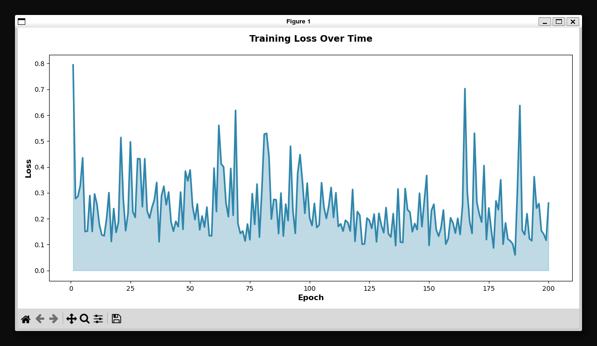
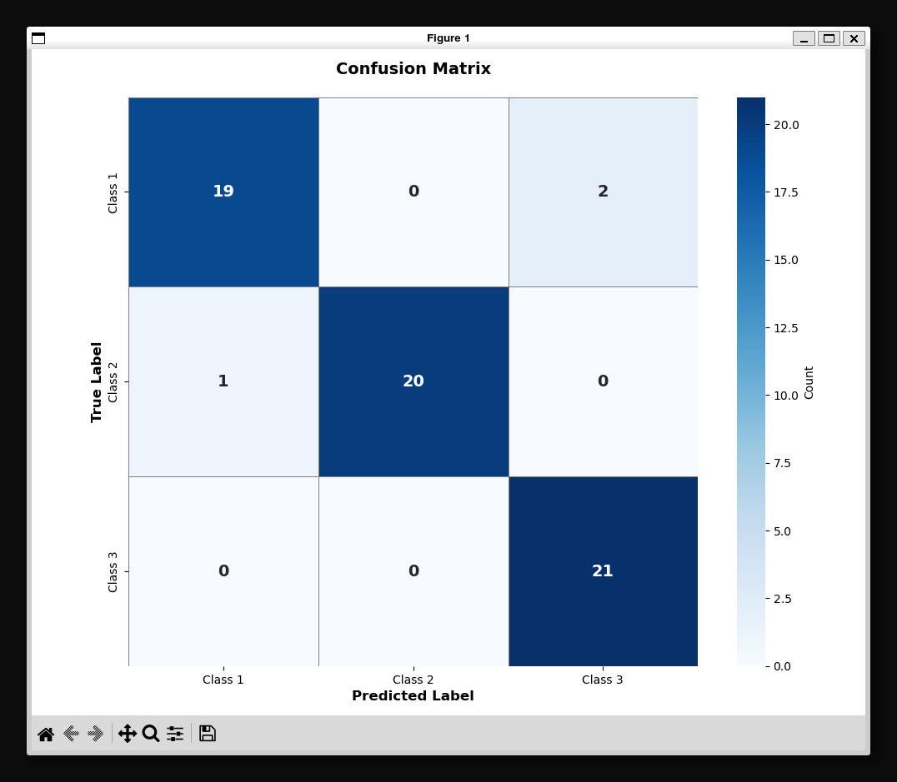

### CIFAR10

Dataset: https://www.cs.toronto.edu/~kriz/cifar.html

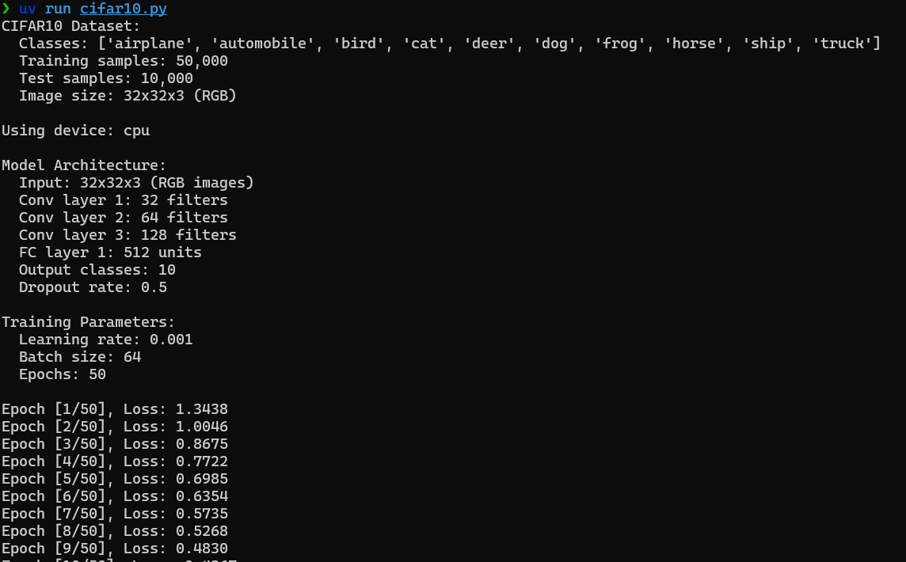
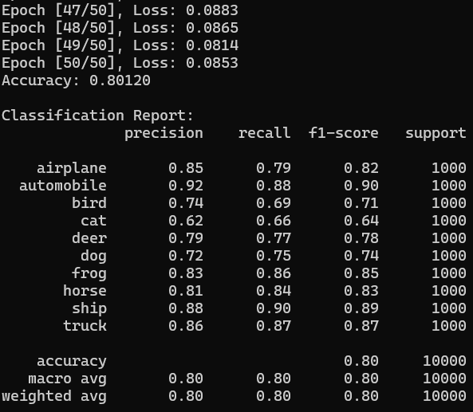
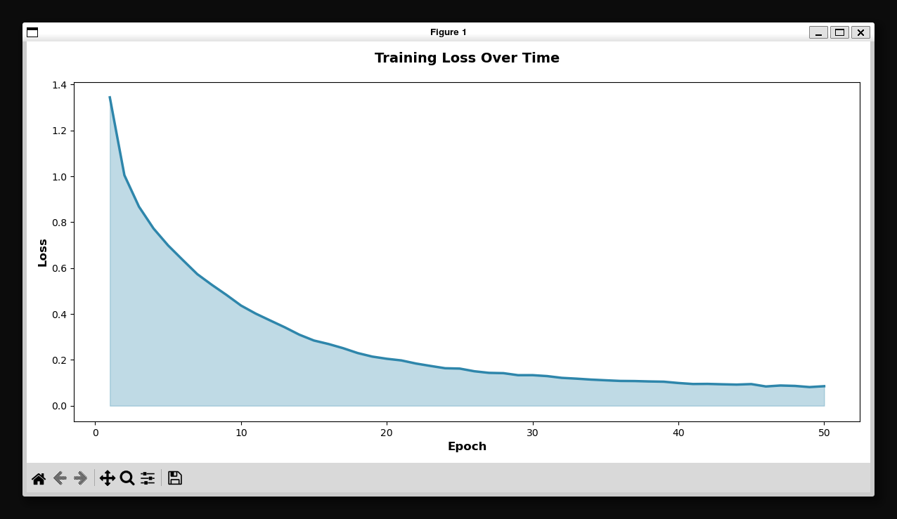
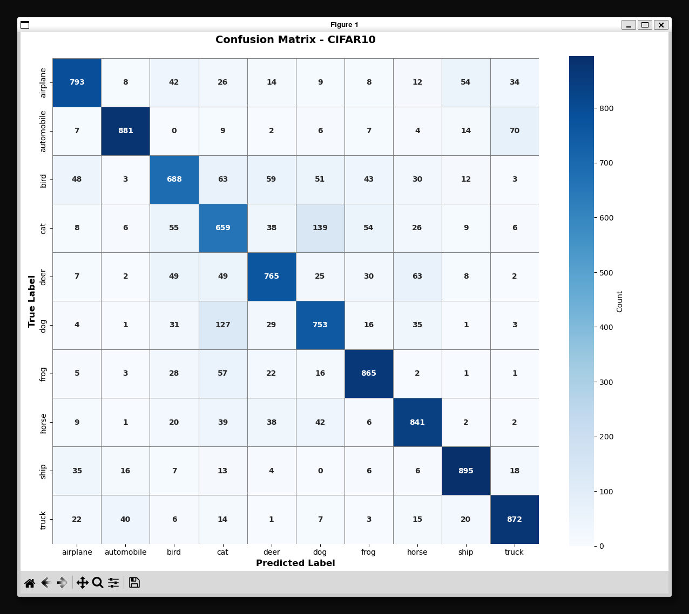

### Fashion MNIST

Dataset: https://github.com/zalandoresearch/fashion-mnist

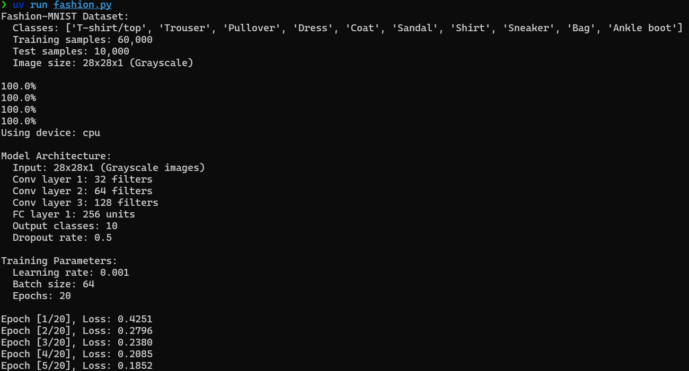
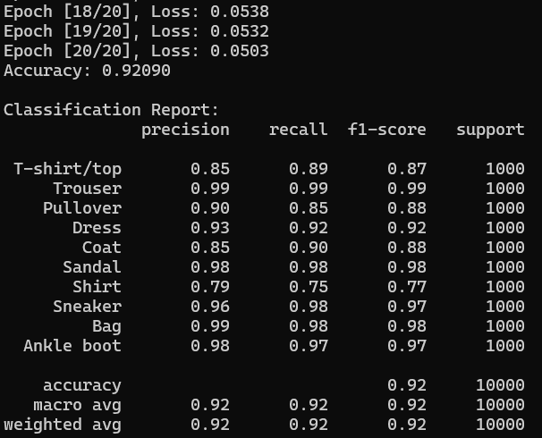
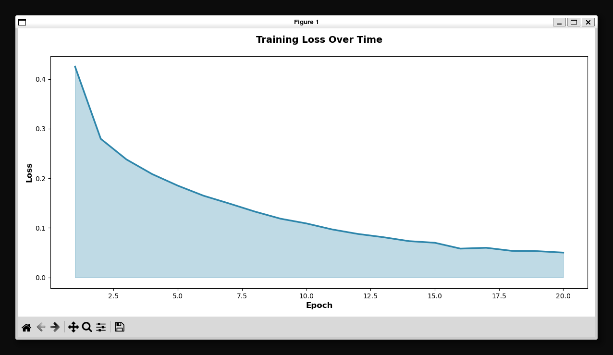

#### Smaller model

- Convolution channel sizes: (32, 64, 128) -> (16, 32, 64)
- Fully connected layer size: 256 -> 128
- Dropout rate: 0.5 -> 0.3

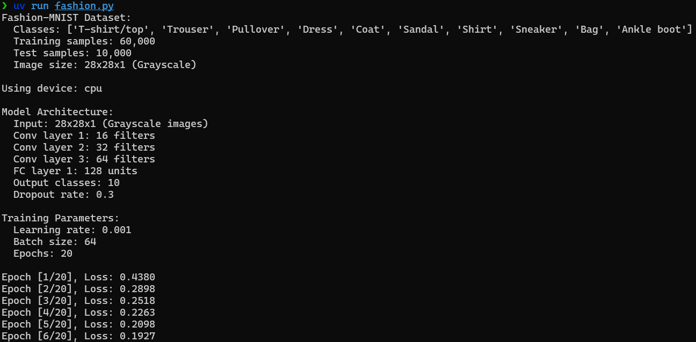
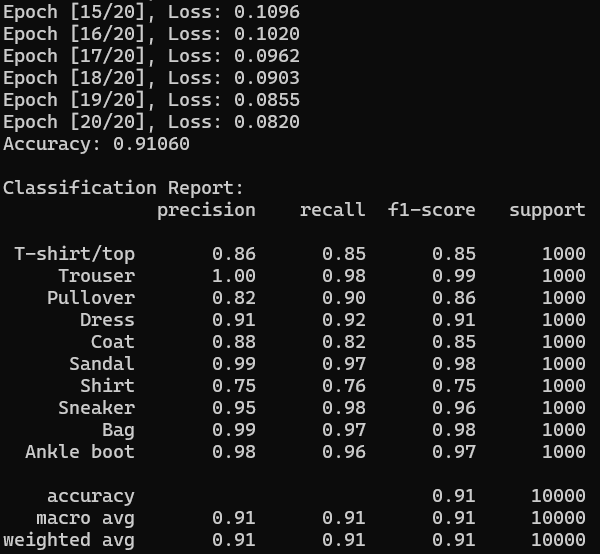
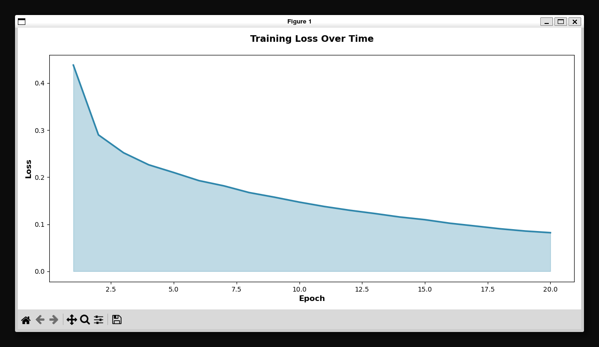
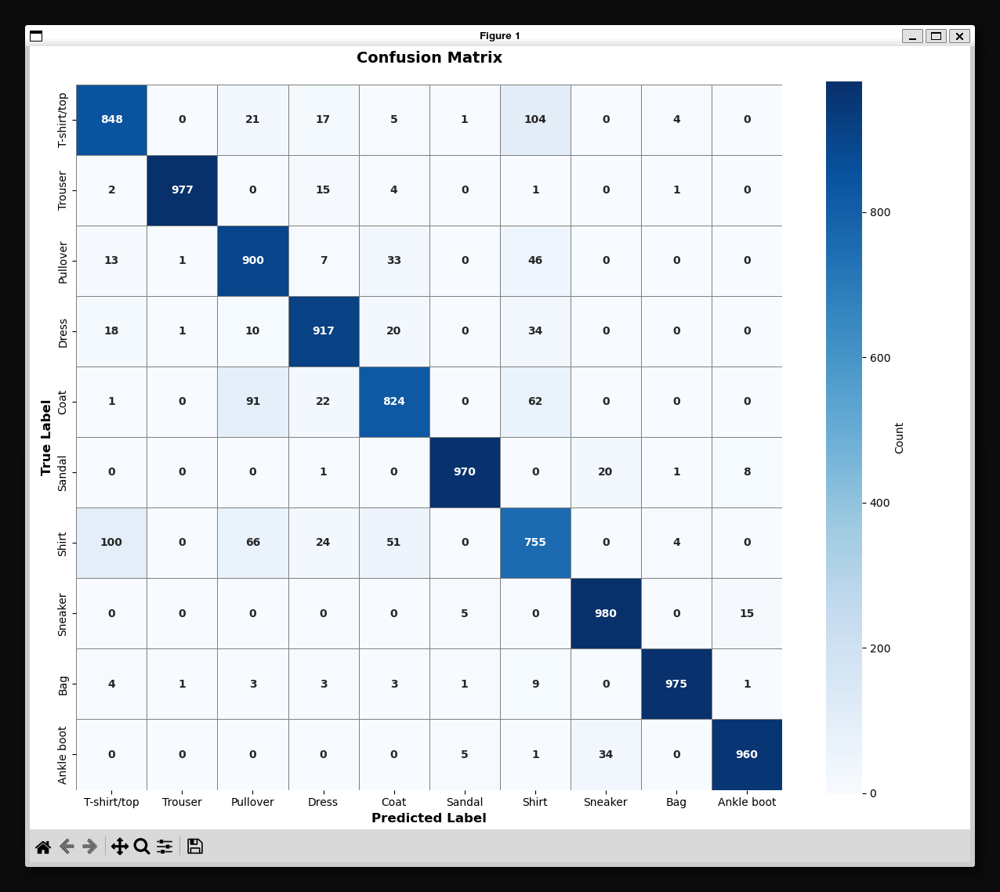
