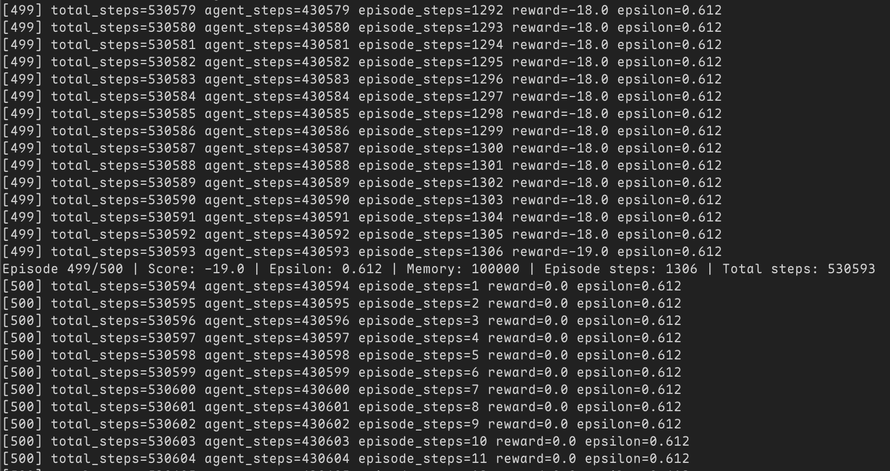

# Reinforcement Learning

## Authors

- Stefan Karczewski (s27459)
- Łukasz Ogorzałek (s27447)

## Running

Make sure you have uv and python, see "Environment Setup" in the main [README.md](../README.md) for more detailed instructions.

When inside the `7-reinforcement-learning` directory:

- Run the program: `uv run main.py`

## Observations

- After training the model for 500 episodes, which took 1h36m50s it's getting some wins, but still losing a lot.

## Example Usage

[example.mp4](https://github.com/user-attachments/assets/123ba33f-7149-4496-b311-9571177453ec)

Logs from a training session:

