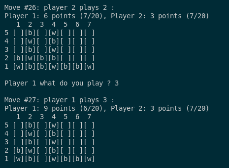

# Best Game Ever Made

## Running

Make sure you have uv and python, see "Environment Setup" in the main [README.md](../README.md) for more detailed instructions.

When inside the `game` directory:
- Run the game: `uv run main.py`
- Run tests: `uv run pytest`

## Rules

- The game is played by two Players, of which one or both can be substituted for AI
- The game board is a 5x7 grid (columns:rows)
- Both Players start with 20 tokens which corresponds to 20 turns of play for each Player
- Each board cell can either remain empty or be occupied by a single token
- Tokens placed in the chosen column always fall and occupy the lowest empty cell

1. Players can place a token in any non-full column during their turn
2. Tokens fall down to the lowest non-occupied row in the chosen column
3. If a token lands on exactly two tokens of the opposite color, they are captured (see below)
4. If there are >=3 tokens of the same color in a column or row, they are scored and removed from the board
5. For each scored token, the Player receives 1 point
6. The game ends either when every cell is occupied or when Players run out of tokens to play
7. The Player with the highest score at the end of the game wins

Capture - two tokens of the opposite color below the token that landed on them are converted to the token color of the Player that placed the token on top them

## Example Gameplay

Example turns:

On Player 2 turn (Move #26):
- Player 2 placed their `[b]` token in column 2, which ocuppied the last available cell in that column (row 5)
- Nothing else happened because there were no tokens to capture or score

On Player 1 turn (Move #27):
- Player 1 placed their `[w]` token in column 3, which fell to the first non-occupied cell in that column (row 3)
- The token connected with two other `[b]` tokens (row 1 and 2) in that column, capturing them
- After capturing, these three tokens were scored and removed from the board
- Player 1 was awarded 3 points (3 tokens were removed)
